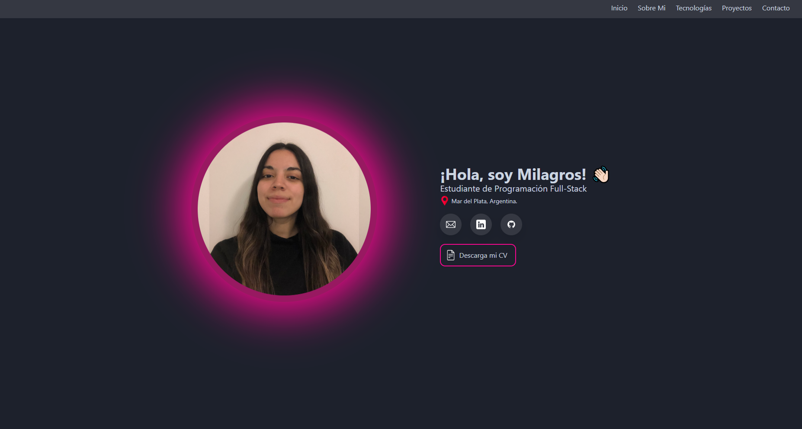

# 🚀 Portfolio Angular

A modern, responsive portfolio built with Angular and Tailwind CSS.  
Showcase my projects, skills, and contact info in a clean, animated single-page app.

---

## ✨ Features

- ⚡ Fast & responsive design
- 🎨 Tailwind CSS styling
- 🖼️ Dynamic project showcase
- 📱 Mobile-friendly navigation
- 📨 Contact & social links
- 🌐 Deployable to GitHub Pages

---

## 📸 Preview



---

## 🛠️ Tech Stack

- [Angular](https://angular.io/)
- [Tailwind CSS](https://tailwindcss.com/)
- [AOS (Animate On Scroll)](https://michalsnik.github.io/aos/)
- [TypeScript](https://www.typescriptlang.org/)


---

## 📂 Folder Structure

```
src/
  ├── about/
  ├── home-page/
  ├── proyects/
  ├── shared/
  └── assets/
      ├── images/
      └── icons/
```

---

## 📬 Contact

- **Email:** serranomilagros23@gmail.com
- **LinkedIn:** [Milagros Serrano](https://www.linkedin.com/in/milagros-serrano-4a49b7307/)
- **GitHub:** [MilagrosSerrano](https://github.com/MilagrosSerrano)

---

## 📝 License

This project is licensed under the MIT License.
